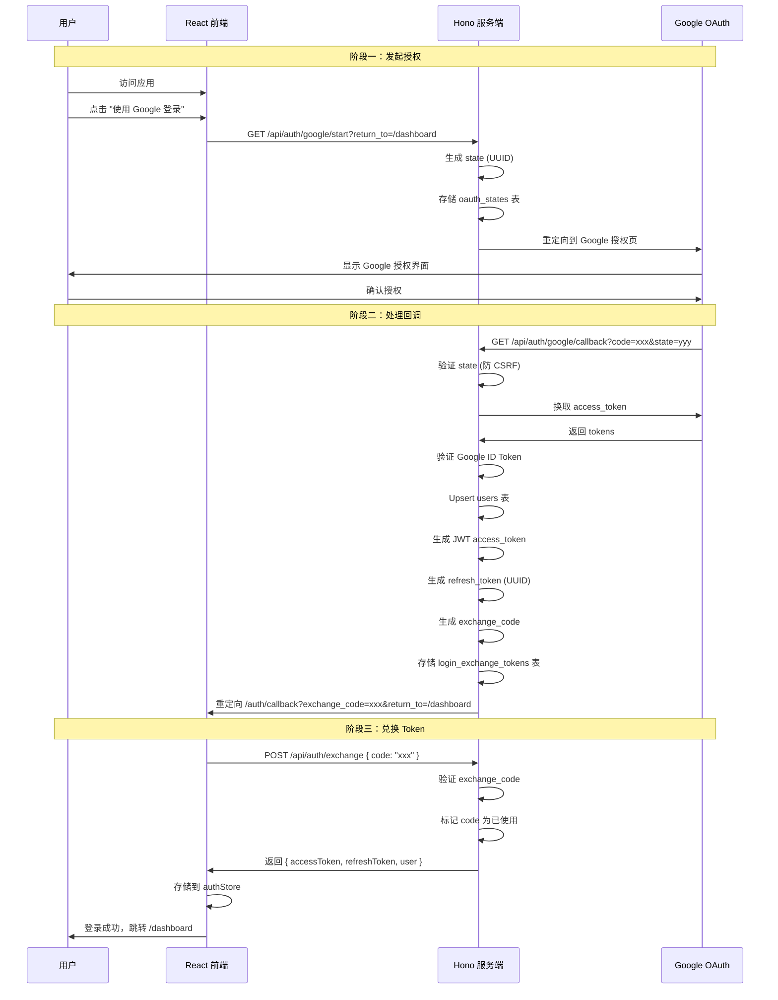
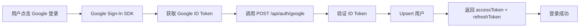
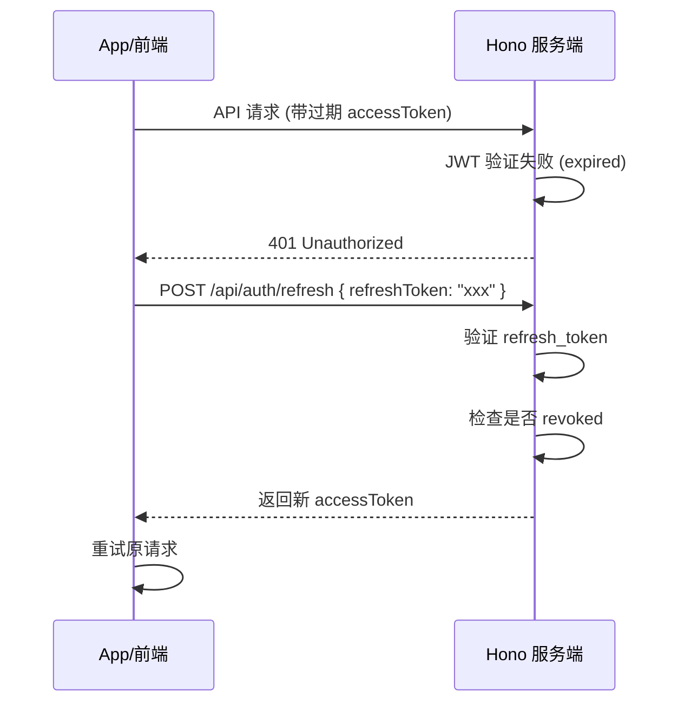

# Google OAuth 登录流程详解

## 概述

MoneyJar 支持两种登录方式：

| 平台 | 登录方式 | 说明 |
|------|----------|------|
| Web 前端 | OAuth 2.0 授权码流程 | 完整的浏览器授权流程 |
| Android | Google ID Token 直接验证 | 使用 Google 登录按钮获取 ID Token |

---

## 一、Web 前端 OAuth 登录流程

### 1.1 完整时序图



### 1.2 流程详解

#### 阶段一：发起授权

```
1. 用户点击 LoginButton (frontend/src/components/common/LoginButton.tsx)
2. 跳转到: GET /api/auth/google/start?return_to=<当前路径>
3. 服务端执行 startOAuth():
   - 验证 return_to 为安全路径（相对路径，以 / 开头）
   - 生成 state (UUID v4)
   - 存储到 oauth_states 表 (10分钟过期)
   - 构建 Google 授权 URL
4. 浏览器重定向到 Google 授权页面
```

#### 阶段二：处理回调

```
5. 用户在 Google 授权后，Google 回调到:
   GET /api/auth/google/callback?code=xxx&state=yyy
6. 服务端执行 handleGoogleCallback():
   - 校验 state（防 CSRF）：查找未过期、未使用的 state
   - 使用 authorization code 向 Google 换取 token
   - 验证 Google ID Token（RS256 验签）
   - Upsert 用户（googleId 唯一标识）
   - 签发 Access Token (JWT, 15分钟有效期)
   - 生成并存储 Refresh Token (UUID, 30天有效期)
   - 生成一次性 exchange code 存入 login_exchange_tokens (5分钟有效期)
   - 标记 state 为已使用
7. 重定向到前端: /auth/callback?exchange_code=xxx&return_to=xxx
```

#### 阶段三：兑换 Token

```
8. CallbackPage 组件接收 exchange_code
9. 调用 completeOAuthLogin(exchange_code):
   POST /api/auth/exchange { code: "xxx" }
10. 服务端验证 exchange_code:
    - 查找未过期、未使用的 code
    - 标记 code 为已使用
    - 返回 accessToken + refreshToken + user 信息
11. 前端存储 tokens 到 authStore (Zustand)
12. 跳转到 return_to 路径
```

### 1.3 核心代码位置

| 功能 | 文件路径 |
|------|----------|
| 登录按钮 | `frontend/src/components/common/LoginButton.tsx` |
| 回调页面 | `frontend/src/pages/CallbackPage.tsx` |
| 状态管理 | `frontend/src/stores/authStore.ts` |
| 路由配置 | `frontend/src/App.tsx` |
| OAuth 路由 | `server/src/routes/auth.route.ts` |
| 核心服务 | `server/src/services/auth.service.ts` |
| 数据访问 | `server/src/repositories/oauth.repository.ts` |

---

## 二、Android 登录流程

### 2.1 流程图



### 2.2 流程详解

```
1. 用户点击 Android Google 登录按钮
2. 调用 Google Sign-In SDK 获取 ID Token
3. 调用 POST /api/auth/google { idToken: "xxx" }
4. 服务端验证 Google ID Token 签名
5. Upsert 用户记录
6. 返回 accessToken + refreshToken
7. Android 端存储 token，开始使用 API
```

### 2.3 Android 核心代码

```kotlin
// Android LoginButton 调用
val idToken = googleAuthApi.getIdToken()  // Google Sign-In SDK
val response = api.loginWithGoogle(idToken)  // POST /api/auth/google

// 存储 token
tokenManager.saveAccessToken(response.accessToken)
tokenManager.saveRefreshToken(response.refreshToken)
```

---

## 三、Token 刷新流程

### 3.1 Access Token 刷新



### 3.2 Refresh Token 续签

- **有效期**: 30 天
- **存储**: `refresh_tokens` 表 (UUID 格式)
- **吊销**: 支持软删除 (`revoked` 字段)

---

## 四、数据库表结构

### 4.1 oauth_states 表

存储 OAuth 流程中的 state 参数（防 CSRF）。

```sql
CREATE TABLE oauth_states (
  id          TEXT PRIMARY KEY,           -- UUID
  state       TEXT NOT NULL UNIQUE,       -- 随机 state 值
  return_to   TEXT DEFAULT '/' NOT NULL,  -- 登录后跳转地址
  created_at  TEXT DEFAULT CURRENT_TIMESTAMP,
  expires_at  TEXT NOT NULL,              -- 10分钟后过期
  used_at     TEXT                        -- NULL=未使用
);
```

### 4.2 login_exchange_tokens 表

存储一次性 exchange code（前端兑换 token 用）。

```sql
CREATE TABLE login_exchange_tokens (
  id            TEXT PRIMARY KEY,
  code          TEXT NOT NULL UNIQUE,     -- 一次性交换码
  user_id       TEXT NOT NULL,
  access_token  TEXT NOT NULL,            -- 短期 JWT
  refresh_token TEXT NOT NULL,            -- 长期 token
  created_at    TEXT DEFAULT CURRENT_TIMESTAMP,
  expires_at    TEXT NOT NULL,            -- 5分钟后过期
  used_at       TEXT                      -- NULL=未使用
);
```

### 4.3 users 表

```sql
CREATE TABLE users (
  id         TEXT PRIMARY KEY,
  email      TEXT NOT NULL UNIQUE,
  name       TEXT,
  avatar_url TEXT,
  plan       TEXT NOT NULL DEFAULT 'free',
  google_id  TEXT NOT NULL UNIQUE,       -- Google OAuth sub
  created_at TEXT NOT NULL,
  updated_at TEXT NOT NULL
);
```

### 4.4 refresh_tokens 表

```sql
CREATE TABLE refresh_tokens (
  id         TEXT PRIMARY KEY,
  user_id    TEXT NOT NULL REFERENCES users(id),
  token      TEXT NOT NULL UNIQUE,        -- UUID
  expires_at TEXT NOT NULL,               -- 30天
  created_at TEXT NOT NULL,
  revoked    INTEGER NOT NULL DEFAULT 0   -- 软吊销标志
);
```

---

## 五、安全机制

| 机制 | 说明 |
|------|------|
| **State 参数** | UUID v4，10分钟有效期，一次性使用，防 CSRF |
| **Exchange Code** | UUID，一次性使用，5分钟有效期 |
| **Open Redirect 防护** | return_to 必须为相对路径（以 `/` 开头） |
| **Google ID Token 验签** | RS256 签名验证，使用 jose 库 |
| **JWT Access Token** | HS256 签名，15分钟有效期 |
| **Refresh Token** | UUID，30天有效期，支持软吊销 |
| **Token 撤销** | logout 时软删除 refresh_token |

---

## 六、API 端点汇总

| 端点 | 方法 | 说明 |
|------|------|------|
| `/api/auth/google/start` | GET | 开始 OAuth 流程，重定向到 Google |
| `/api/auth/google/callback` | GET | 处理 Google 回调 |
| `/api/auth/exchange` | POST | 前端用 exchange code 兑换 tokens |
| `/api/auth/google` | POST | Android ID Token 登录 |
| `/api/auth/test-token` | POST | 测试环境调试 |
| `/api/auth/refresh` | POST | 刷新 access token |
| `/api/auth/logout` | POST | 登出并吊销 refresh token |
| `/api/auth/me` | GET | 获取当前用户信息 |

---

## 七、环境变量

```bash
# Google OAuth
GOOGLE_CLIENT_ID=xxx
GOOGLE_CLIENT_SECRET=xxx
GOOGLE_REDIRECT_URI=https://your-domain.com/api/auth/google/callback

# JWT
JWT_SECRET=xxx

# App
APP_BASE_URL=https://your-frontend-domain.com

# Development
TEST_AUTH_TOKEN=xxx  # 测试环境调试用
```
